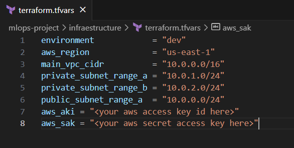
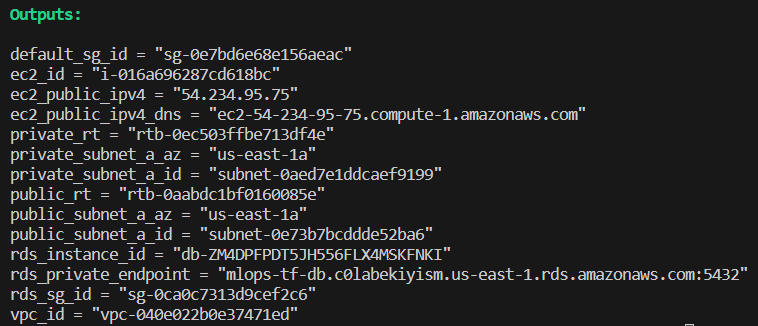
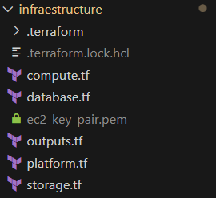
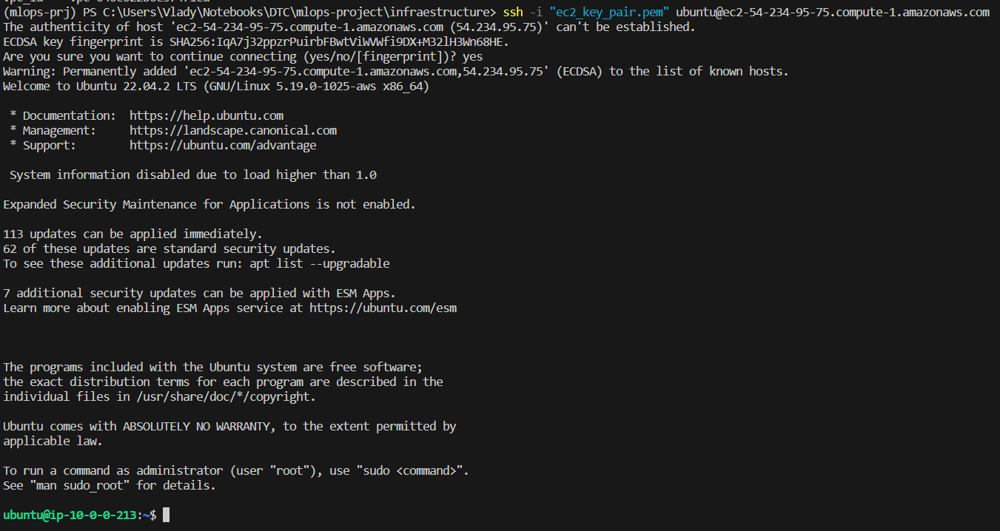
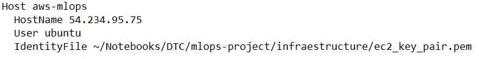
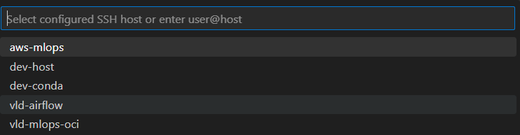

# MLOps Zoomcamp Project - Telco Customer Churn
Final project for MLops Zoomcamp cohort 2023

## Objective

The Telco customer churn data contains information about a fictional telco company that provided home phone and Internet services to 7043 customers in California in Q3. It indicates which customers have left, stayed, or signed up for their service. Multiple important demographics are included for each customer, as well as a Satisfaction Score, Churn Score, and Customer Lifetime Value (CLTV) index.

## Dataset 
Features

* CustomerID: A unique ID that identifies each customer.

* Gender: The customer’s gender: Male, Female

* Senior Citizen: Indicates if the customer is 65 or older: Yes, No

* Partner :

* Dependents: Indicates if the customer lives with any dependents: Yes, No. Dependents could be     children, parents, grandparents, etc.

* Tenure in Months: Indicates the total amount of months that the customer has been with the company

* PhoneService : Phone Service: Indicates if the customer subscribes to home phone service with the company: Yes, No

* Multiple Lines: Indicates if the customer subscribes to multiple telephone lines with the company: Yes, No

* Internet Service: Indicates if the customer subscribes to Internet service with the company: No, DSL, Fiber Optic, Cable.

* Online Security: Indicates if the customer subscribes to an additional online security service provided by the company: Yes, No

* Online Backup: Indicates if the customer subscribes to an additional online backup service provided by the company: Yes, No

* Device Protection Plan: Indicates if the customer subscribes to an additional device protection plan for their Internet equipment provided by the company: Yes, No

* Tech Support: Indicates if the customer subscribes to an additional technical support plan from the company with reduced wait times: Yes, No

* Streaming TV: Indicates if the customer uses their Internet service to stream television programing from a third party provider: Yes, No. The company does not charge an additional fee for this service.

* Streaming Movies: Indicates if the customer uses their Internet service to stream movies from a third party provider: Yes, No. The company does not charge an additional fee for this service.

* Contract: Indicates the customer’s current contract type: Month-to-Month, One Year, Two Year.

* Paperless Billing: Indicates if the customer has chosen paperless billing: Yes, No

* Monthly Charge: Indicates the customer’s current total monthly charge for all their services from the company.

* Total Charges: Indicates the customer’s total charges, calculated to the end of the quarter specified above.

Target
* Churn : Customers who left within the last month

## Tools used

- AWS — Cloud service
- Docker — Containerization
- Prefect — Workflow orchestrator
- MLFlow — Experiment tracker and model register
- Flask — Web API
- dotenv — environment variable loader

## Pre-requisites

AWS Account - Credentials loaded

## Infraestructure Provisioning

Go to "infraestructure" folder, edit file *terraform.tfvars* with your AWS credentials and region.

Then run terraform apply

> terraform apply

When deployment finish, Terraform will return data about deployment, where you can find IP and DNS of the new EC2 instance:

It also will create a Key Pair file to connect to EC2 instance:

Then, you can connect throught SSH using key pair file and EC2 IP/DNS

Or, you can edit your .ssh/config file and add a new host:

And connect VS Code to the instance:

When all experiments are finished, just destroy all deployments running:

> terraform destroy

## Further improvements

- [ ] Add a monitoring service
- [ ] Create a Frontend for the API
- [x] Implement IaC
- [ ] Use CI/CD
- [x] Create tests

## Disclaimer

The prediction model was created solely with the purpose in create a MLOps pipeline
and is not advisable to use the deployed model in real cases.